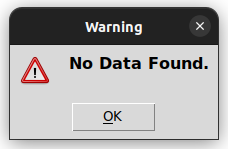

# Password-Manager

### [twitter](https://twitter.com/achte_te)

## Description

A GUI based Password Manager. 

This Application:
    * can store passwords  
    * search for entries.  
    * generate passwords.  
    * copy the generated password automatically to the clipboard.  
    * data is stored in .JSON format.  

## Requirements

[Python](https://www.python.org/)

```sh
$ python3 --version
Python 3.9.12
```

[Tkinter](https://docs.python.org/3/library/tkinter.html)

[JSON](https://www.json.org/json-en.html)

[Pyperclip](https://pypi.org/project/pyperclip/)

## Install

```sh
$ git clone git@github.com:achte-2022/Password-Manager.git
```

## Run

```sh
$ cd Password-Manager
$ python3 main.py
```

## Application Screen

### Starting Screen


### Password Generation Screen


### Search Screen


### File not found Screen


### Entry not found Screen
